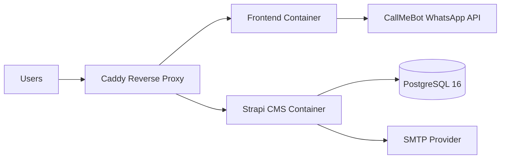

# Architecture Overview

## 1) High-Level System Architecture

The production platform follows a three-service architecture:

1. Frontend service (React + Vite build served in container)
2. CMS/API service (Strapi v5)
3. PostgreSQL database service

Traffic routing and TLS termination are managed by a separate Caddy reverse proxy service.

## 2) Runtime Topology

## 3) Repository Architecture

### Root workspace

- Contains a root Vite app (`src/`, `styles/`) and shared project-level files.
- Includes the platform workspace as `techderby-platform/`.

### Platform workspace (`techderby-platform/`)

- `frontend/`: main React frontend for platform/public experience
- `cms/`: Strapi backend with custom APIs and lifecycle hooks
- `docker/`: reverse proxy configs
- compose files for local, dev, uat, prod deployment modes

## 4) API Layer Design

The frontend API client is centralized in:

- `techderby-platform/frontend/src/lib/api.ts`

It provides typed wrappers for:

- content (events, posts, partners, programmes)
- auth/profile
- member directory
- connections
- messages
- notifications

JWT handling is implemented with request/response interceptors.

## 5) Data and Domain Design (Current State)

Primary domain areas implemented in CMS (`techderby-platform/cms/src/api`):

- content: event, post, partner, programme, speaker, member
- engagement: mailing-list-subscription, notify
- community: profile, member-directory, connection, message

Notable behavior:

- Event lifecycle hook sends publish notifications to mailing list subscribers.
- Member-directory endpoint applies visibility filtering by role.
- Messaging endpoints enforce accepted connection checks before message access/send.

## 6) Environment Topology

### Local development

- Compose file: `techderby-platform/docker-compose.yml`
- Frontend: localhost:3000
- Strapi: localhost:1337
- Postgres: localhost:5432

### Hosted environments

- Dev stack uses `docker-compose.images.dev.yml`
- UAT stack uses `docker-compose.images.uat.yml`
- Prod stack uses `docker-compose.images.yml`
- Caddy shared proxy uses `docker-compose.caddy.yml`

The environment compose files isolate container names and ports by environment.
