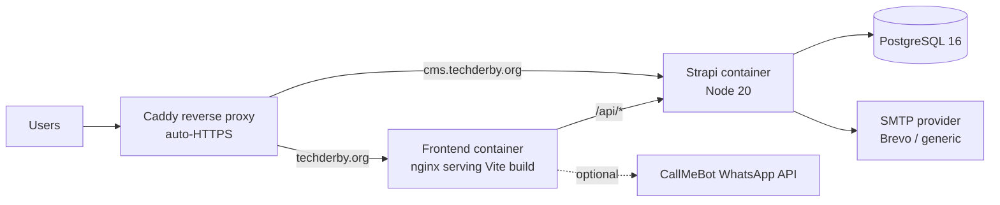

# Tech Derby Webapp — Build & Handover Document

This document is a complete handover of the work done on the Tech Derby webapp so far. It is written for the next engineer taking ownership of the project. It explains what was built, how it was built, the technologies and patterns used, where every feature lives in the codebase, and how the system is deployed and operated.

> Companion docs in this folder:
> - [Architecture Overview](./ARCHITECTURE-OVERVIEW.md)
> - [Feature Inventory](./FEATURE-INVENTORY.md)
> - [CI/CD and Release Strategy](./CICD-AND-RELEASE.md)
> - [Git Branching Strategy](./GIT-BRANCHING-STRATEGY.md)
> - [External Integrations](./EXTERNAL-INTEGRATIONS.md)

---

## 1. Executive Summary

The Tech Derby webapp is a full-stack community platform for Tech Derby (Derby, UK). The active production codebase lives in [techderby-platform/](../techderby-platform) and consists of:

- A React 18 + Vite + TypeScript frontend (`techderby-platform/frontend`).
- A Strapi v5 CMS/API (`techderby-platform/cms`) backed by PostgreSQL 16.
- A Dockerized deployment model using Docker Hub images, a Caddy reverse proxy, and GitHub Actions for CI/CD across three environments (dev, UAT, production).

The repository also contains a root-level Vite scaffold under [src/](../src) used for design-system exploration / prototype work — production traffic is served by the `techderby-platform/frontend` build.

What's already built (high level):

- Full public marketing site: Home, About, Programmes (incl. TechStar Women, Pre-Seed Accelerator, Summit 2026), Events (list + detail + registration), Wire (blog), Partners, Membership, Get Involved, Contact, Policies (Privacy, Cookie, Data, Code of Conduct, Accessibility, Safeguarding).
- Authenticated member platform: register, login, forgot/reset password, profile (with avatar upload), public/private member directory, connections (LinkedIn-style requests), and 1:1 messaging.
- CMS-managed content: Events, Posts (Wire), Partners, Programmes, Members, Speakers.
- Mailing list capture with token-protected CSV export.
- Lifecycle-driven transactional email: event-publish broadcast, password reset, form notifications.
- Optional WhatsApp notifications for selected form submissions.
- CI pipeline (lint/type-check/test/build) and image-based deploys to dev, UAT, and production VPS.

---

## 2. Technology Stack

### 2.1 Frontend (`techderby-platform/frontend`)

| Concern | Choice | Notes |
|---|---|---|
| Framework | React 18 | Function components + hooks |
| Build tool | Vite 6 | Dev server on port 3000, `--host 0.0.0.0` |
| Language | TypeScript ~5.6 | Strict mode via `tsconfig.json` |
| Routing | `react-router-dom` v7 | `createBrowserRouter`, route-level `lazy()` |
| Data fetching | `@tanstack/react-query` v5 | Caching for content APIs |
| HTTP | `axios` | Centralized client in [frontend/src/lib/api.ts](../techderby-platform/frontend/src/lib/api.ts) |
| Validation | `zod` | Response normalization in [content-service.ts](../techderby-platform/frontend/src/services/content-service.ts) |
| Styling | Tailwind CSS 3.4 + custom CSS | `postcss` + `autoprefixer` |
| SEO | `react-helmet-async` | `PageSeo` component on routes |
| Auth state | Custom React Context | `AuthContext` (JWT) |
| Testing | Vitest + Testing Library + jsdom | `npm test` runs Vitest |
| Lint/format | ESLint 8 + Prettier 3 | `npm run lint`, `npm run format` |
| Container serve | nginx 1.27 (Alpine) | SPA fallback + cache headers ([nginx.conf](../techderby-platform/frontend/docker/nginx.conf)) |

Build is configured in [frontend/vite.config.ts](../techderby-platform/frontend/vite.config.ts). In dev it proxies `/api` to the Strapi container.

### 2.2 Backend / CMS (`techderby-platform/cms`)

| Concern | Choice | Notes |
|---|---|---|
| Framework | Strapi v5 (`5.6.0`) | Headless CMS + custom REST APIs |
| Language | TypeScript | Strict-enough config |
| Runtime | Node.js 20 (Alpine) | Pinned in `engines` and Dockerfiles |
| Database | PostgreSQL 16 | `pg` driver, configured in [cms/config/database.ts](../techderby-platform/cms/config/database.ts) |
| Auth | `@strapi/plugin-users-permissions` | JWT-based, `bcryptjs` for register/reset |
| Email | `@strapi/provider-email-nodemailer` | SMTP via Brevo by default ([plugins.ts](../techderby-platform/cms/config/plugins.ts)) |
| Direct email | `nodemailer` | Used in event lifecycle hook |
| File uploads | Local disk | Avatars stored under `public/uploads/` |
| Extensions | `react-router-dom` v6 + `styled-components` | Strapi admin UI customizations |

### 2.3 Infrastructure & Tooling

| Concern | Choice |
|---|---|
| Containerization | Docker + Docker Compose |
| Image registry | Docker Hub |
| Reverse proxy / TLS | Caddy 2 (Alpine), Let's Encrypt |
| CI/CD | GitHub Actions |
| Remote deploy | `appleboy/ssh-action`, `appleboy/scp-action` |
| WhatsApp notifications | CallMeBot HTTP API |
| Hosting | Hetzner VPS (single host with three environments) |

---

## 3. Repository Layout

```text
techderby-webapp/
├── .github/workflows/         CI + deploy pipelines (4 workflows)
├── docs/                      Engineering onboarding & this build doc
├── guidelines/                Team guidelines (Markdown)
├── src/, styles/              Root Vite app (design-system prototype)
├── package.json, vite.config.ts, postcss.config.mjs, index.html
├── Makefile                   Convenience targets for compose stacks
└── techderby-platform/        ← Production application lives here
    ├── frontend/              React + Vite + TS
    ├── cms/                   Strapi v5 + Postgres APIs
    ├── docker/                Caddyfile + nginx config (shared)
    ├── docker-compose.yml             Local dev
    ├── docker-compose.images.yml      Production deploy (image-based)
    ├── docker-compose.images.dev.yml  Dev environment
    ├── docker-compose.images.uat.yml  UAT environment
    ├── docker-compose.caddy.yml       Shared reverse proxy
    └── .env.example + .env.dev.example + .env.test.example + .env.prod.example
```

---

## 4. Architecture

### 4.1 Runtime topology



Per environment, Caddy fronts a separate container stack (different ports/DB/network):

| Env  | Frontend URL                | CMS URL                          | FE port | CMS port |
|------|-----------------------------|----------------------------------|---------|----------|
| Prod | `https://techderby.org`     | `https://cms.techderby.org`      | 3000    | 1337     |
| UAT  | `https://test.techderby.org`| `https://cms-test.techderby.org` | 3002    | 1339     |
| Dev  | `https://dev.techderby.org` | `https://cms-dev.techderby.org`  | 3001    | 1338     |

See [techderby-platform/docker/Caddyfile](../techderby-platform/docker/Caddyfile).

### 4.2 Frontend architecture

Entry point: [frontend/src/main.tsx](../techderby-platform/frontend/src/main.tsx).

Provider stack (outer → inner):
- `HelmetProvider` (SEO)
- `QueryClientProvider` (React Query cache)
- `AuthProvider` (custom context)
- `RouterProvider` (react-router)

Routing model — [frontend/src/router/routes.tsx](../techderby-platform/frontend/src/router/routes.tsx):

- All pages are `React.lazy()` imports wrapped in `<Suspense>` (`withLazy` helper) for route-level code splitting.
- Three top-level route groups:
  - Standalone auth pages (`/login`, `/register`, `/forgot-password`, `/reset-password`).
  - `/dashboard/*` protected area wrapped in `<ProtectedRoute>` + `DashboardLayout`.
  - All other public pages under `PublicLayout` (`Navbar` + `<Outlet />` + `Footer`).
- Catch-all `*` routes resolve to `NotFoundPage`.

Layouts:
- [PublicLayout.tsx](../techderby-platform/frontend/src/layouts/PublicLayout.tsx) — simple shell.
- [DashboardLayout.tsx](../techderby-platform/frontend/src/layouts/DashboardLayout.tsx) — sidebar nav, role badge, brand logo, logout.

Auth:
- [contexts/AuthContext.tsx](../techderby-platform/frontend/src/contexts/AuthContext.tsx) holds `{ user, jwt, isLoading, isAuthenticated, login, register, logout, updateProfile, refreshUser }`.
- JWT is persisted to `localStorage` when "remember me" is on, otherwise `sessionStorage`. Storage keys: `td_jwt`, `td_user`.
- On mount, if a JWT exists, the provider calls `/api/profile` to hydrate the full user (including custom fields).
- The axios interceptor in [lib/api.ts](../techderby-platform/frontend/src/lib/api.ts) attaches `Authorization: Bearer <jwt>` and dispatches a `td:auth:expired` event on 401, which the provider listens for and clears auth.
- [components/ProtectedRoute.tsx](../techderby-platform/frontend/src/components/ProtectedRoute.tsx) gates `/dashboard` and also supports `requiredRole` with a `member → editor → admin → super-admin` ordering.

Data layer:
- All API calls funnel through `apiClient` in [lib/api.ts](../techderby-platform/frontend/src/lib/api.ts).
- Content endpoints (events, posts, partners, programmes) are normalized and validated with `zod` in [services/content-service.ts](../techderby-platform/frontend/src/services/content-service.ts), which handles both Strapi `{ data: [{ id, attributes }] }` and flat array shapes.
- React Query hooks in [hooks/use-content-query.ts](../techderby-platform/frontend/src/hooks/use-content-query.ts) expose `useEvents`, `usePartners`, `useInsights`, `useInsightBySlug`, `useProgrammes`.
- TypeScript types live in [types/content.ts](../techderby-platform/frontend/src/types/content.ts) and [types/auth.ts](../techderby-platform/frontend/src/types/auth.ts).

UI primitives: small in-house Tailwind-styled components in [components/ui/](../techderby-platform/frontend/src/components/ui) (`Button`, `Card`, `Input`, `Badge`, `Tag`, `Section`, `Container`). Domain components include `Navbar`, `Footer`, `Hero`, `EventCard`, `MemberCard`, `PartnerCard`, `CTASection`, `PageSeo`, `WaterRipple`.

### 4.3 Backend architecture

The CMS exposes:

1. Strapi-generated REST APIs for the standard content types (events, posts, partners, programmes, members, speakers).
2. Custom routes/controllers for domain features that didn't fit a CRUD pattern (profile/auth, member-directory, connections, messages, notify, mailing list CSV export).

Custom logic lives under `techderby-platform/cms/src/api/<name>/{routes,controllers,services,content-types}/*.ts`. Notable patterns:

- **Raw knex for `up_users`.** Strapi's ORM drops extension columns added to the users table (`firstName`, `lastName`, `bio`, `location`, `occupation`, `skills`, `certifications`, `isVisible`, `avatar`, `socialLinks`, `memberRole`). The profile and member-directory controllers therefore use `strapi.db.connection` (knex) directly to read/write users, and have a `sanitize()` / `pickPublicFields()` helper to whitelist returned columns and parse JSON-string fields. See [profile/controllers/profile.ts](../techderby-platform/cms/src/api/profile/controllers/profile.ts) and [member-directory/controllers/member-directory.ts](../techderby-platform/cms/src/api/member-directory/controllers/member-directory.ts).
- **Custom auth endpoints.** `POST /api/auth/register`, `POST /api/auth/forgot-password`, `POST /api/auth/reset-password` are mounted in [profile/routes/profile.ts](../techderby-platform/cms/src/api/profile/routes/profile.ts). They wrap `bcryptjs` for password hashing and `strapi.plugin('users-permissions').service('jwt').issue()` for JWT issuance. Forgot-password always returns 200 to prevent email enumeration.
- **Email templates inlined.** The forgot-password and notify flows render branded HTML emails in-controller, including a base64-embedded logo from `public/techderbywhitelogo.webp` (no external image dependency).
- **Event publish notifications.** [event/content-types/event/lifecycles.ts](../techderby-platform/cms/src/api/event/content-types/event/lifecycles.ts) hooks `afterCreate`, `beforeUpdate`, `afterUpdate`. On the first transition to published (`publishedAt` set, `mailingListNotifiedAt` empty), it fetches all subscribers and sends a BCC notification via `nodemailer`, then stamps `mailingListNotifiedAt` to prevent duplicates.
- **Connections + messaging are auth-walled.** Messaging endpoints in [message/controllers/message.ts](../techderby-platform/cms/src/api/message/controllers/message.ts) verify an `accepted` connection exists between sender and recipient before reading/writing messages, and mark incoming messages read on conversation fetch.
- **Member directory visibility.** [member-directory/controllers/member-directory.ts](../techderby-platform/cms/src/api/member-directory/controllers/member-directory.ts) returns only `isVisible=true && !blocked` users to anyone except admin / super-admin.
- **Mailing list CSV export.** [mailing-list-subscription/controllers/mailing-list-subscription.ts](../techderby-platform/cms/src/api/mailing-list-subscription/controllers/mailing-list-subscription.ts) and [routes/custom-mailing-list-subscription.ts](../techderby-platform/cms/src/api/mailing-list-subscription/routes/custom-mailing-list-subscription.ts) define a token-protected route `GET /api/mailing-list-subscriptions/export` requiring a scoped Strapi API token.

### 4.4 Data model

Strapi-managed content types (declared in `cms/src/api/<name>/content-types/<name>/schema.ts`):

| Type | Key fields | Notes |
|---|---|---|
| `event` | title, slug (uid), description, date, venue, eventSource (`tech-derby`/`other`), theme, shortLine, eventRegistrationLink, agenda (richtext), agendaItems (json), speakers (m2m → speaker), speakerCards (json), registrationLink, mailingListNotifiedAt | Draft & publish enabled |
| `post` (Wire) | title, slug, featuredImage, content (richtext), author, tags (json), category | "Insights" in admin, displayName "Post (Articles)" |
| `partner` | name, logo, description, website, partnerType (enum), category (enum) | Two enums for filtering flexibility |
| `programme` | title, slug, description | Minimal — display content rendered in frontend |
| `speaker` | name, role, organisation, bio, photo, talkTitle | Related to events m2m |
| `member` | name, role, bio, skills (json), interests (json), linkedin | Legacy/static directory entries |
| `mailing-list-subscription` | email (unique) | No draft/publish |
| `connection` | requesterId, recipientId, status (`pending`/`accepted`/`rejected`) | App-managed (not via Strapi admin) |
| `message` | fromUserId, toUserId, content, readAt | App-managed |

The Strapi `users-permissions` users table is extended with extra columns: `firstName`, `lastName`, `bio`, `location`, `occupation`, `skills`, `certifications`, `isVisible`, `avatar`, `socialLinks`, `memberRole`. These are accessed via knex (see §4.3).

### 4.5 API surface (consumed by the frontend)

Implemented in [frontend/src/lib/api.ts](../techderby-platform/frontend/src/lib/api.ts):

Content:
- `GET /api/events`
- `GET /api/partners?populate=logo`
- `GET /api/posts?populate=featuredImage`
- `GET /api/posts?filters[slug][$eq]=<slug>&populate=featuredImage`
- `GET /api/programmes`
- `POST /api/mailing-list-subscriptions`
- `GET /api/mailing-list-subscriptions/export` (Bearer token, scoped)

Auth & profile:
- `POST /api/auth/register` (custom)
- `POST /api/auth/local` (Strapi built-in)
- `POST /api/auth/forgot-password` (custom)
- `POST /api/auth/reset-password` (custom)
- `GET /api/users/me?populate=role`
- `GET /api/profile`, `PUT /api/profile`, `POST /api/profile/avatar`

Community:
- `GET /api/members-directory`, `GET /api/members-directory/:id`
- `GET /api/connections/mine`, `POST /api/connections`, `PUT /api/connections/:id/{accept|reject}`, `DELETE /api/connections/:id`
- `GET /api/messages/inbox`, `GET /api/messages/conversation/:userId`, `POST /api/messages`

Notifications:
- `POST /api/notify` — sends a styled HTML email to `technical@techderby.org` for form submissions.

---

## 5. Feature Build Log

This section documents what was built, where it lives, and how it works.

### 5.1 Public website

| Route | Page component | Notes |
|---|---|---|
| `/` | `HomePage.tsx` | Hero, programmes preview, upcoming events, CTA blocks |
| `/about` | `AboutPage.tsx` | Mission/vision/values/governance; team section intentionally hidden |
| `/events` | `EventsPage.tsx` | Segmentation `tech-derby` vs `other`, Upcoming/Past tabs, theme/audience/format/search filters for "Others" only |
| `/events/:slug` | `EventDetailPage.tsx` | Event details + agenda + speakers + standard accessibility block |
| `/events/browse` | `EventRegistrationPage.tsx` | Alternative browsing/registration entry point |
| `/summit-2026` | `TechDerbySummitPage.tsx` | Standalone summit landing |
| `/programmes` | `ProgrammesPage.tsx` | List of programmes |
| `/programmes/tech-star-women` | `TechStarWomenPage.tsx` | Programme microsite |
| `/tech-derby-accelerator`, `/programmes/pre-seed-accelerator` | `TechDerbyAcceleratorPage.tsx` | Pre-seed accelerator landing |
| `/programmes/pre-seed-accelerator/apply` | `AcceleratorApplicationPage.tsx` | Application form (sends notify email + optional WhatsApp ping) |
| `/membership` | `MembershipPage.tsx` | Membership interest form |
| `/partners` | `PartnersPage.tsx` | Partner directory from CMS |
| `/wire`, `/wire/:slug` | `InsightsPage.tsx`, `InsightDetailPage.tsx` | Blog. `/insights` and `/insights/:slug` redirect here for legacy URLs |
| `/community`, `/get-involved`, `/contact` | `CommunityPage.tsx`, `GetInvolvedPage.tsx`, `ContactPage.tsx` | Contact and Membership pages also trigger `/api/notify` and optional WhatsApp |
| `/directory` | `MemberDirectoryPage.tsx` | Public directory (calls `/api/members-directory` — auth optional) |
| Policy pages | `PrivacyPolicyPage`, `CookiePolicyPage`, `DataPolicyPage`, `CodeOfConductPage`, `AccessibilityPage`, `SafeguardingPage` | Static |
| `*` | `NotFoundPage.tsx` | 404 |

Static-asset injection, SEO per route, and lazy loading are implemented uniformly via `PageSeo` and `withLazy`.

### 5.2 Authentication

Frontend pages: `LoginPage.tsx`, `RegisterPage.tsx`, `ForgotPasswordPage.tsx`, `ResetPasswordPage.tsx`.

Backend flow:
- **Register** → `POST /api/auth/register` (custom): validates uniqueness, bcrypt-hashes password, inserts into `up_users` via knex, links to `authenticated` role, issues JWT.
- **Login** → `POST /api/auth/local` (Strapi default).
- **Forgot password** → custom controller writes a random `reset_password_token` to the user row and emails a branded reset link to `PUBLIC_FRONTEND_URL/reset-password?code=<token>`. Always returns 200.
- **Reset password** → custom controller validates token + password rules, bcrypt-hashes, clears token.

Frontend persistence:
- Session vs persistent storage selected by "remember me".
- Global `td:auth:expired` event clears state if any request 401s.

### 5.3 Member dashboard

Routes mounted under `/dashboard` (all `ProtectedRoute`-wrapped):

- `/dashboard` → `DashboardHomePage.tsx`
- `/dashboard/profile` → `ProfilePage.tsx` (edit bio/location/occupation/skills/certifications/visibility/socials; avatar upload via multipart `POST /api/profile/avatar`)
- `/dashboard/directory` → `DirectoryPage.tsx` (authenticated view of `/api/members-directory`)
- `/dashboard/connections` → `ConnectionsPage.tsx` (sent/received requests, accept/reject/remove)
- `/dashboard/messages`, `/dashboard/messages/:userId` → `ChatPage.tsx` (inbox + per-user thread)

### 5.4 Connections (LinkedIn-style)

- Schema: `connection { requesterId, recipientId, status }`.
- Endpoints: `GET /connections/mine` (enriched with the "other user" + `direction`), `POST /connections`, `PUT /connections/:id/{accept|reject}`, `DELETE /connections/:id`.
- Business rules enforced in controller:
  - Can't self-connect.
  - Recipient must exist and not be blocked.
  - Only one connection record between any two users.
  - Only the recipient may accept/reject.
  - Either party may delete.

### 5.5 Messaging

- Schema: `message { fromUserId, toUserId, content, readAt }`.
- Endpoints: `GET /messages/inbox` (latest message per accepted-connection partner + unread count), `GET /messages/conversation/:userId` (returns thread and auto-marks incoming as read), `POST /messages`.
- Send/read is gated by an `accepted` connection between the two users.

### 5.6 Mailing list

- Public `POST /api/mailing-list-subscriptions` with `{ data: { email } }`.
- Scoped CSV export at `GET /api/mailing-list-subscriptions/export` — requires a Strapi API token with scope `api::mailing-list-subscription.mailing-list-subscription.exportCsv`.
- Output is RFC-4180-style CSV with safe quoting and a timestamped filename.

### 5.7 Event-publish broadcast email

- Implemented as a Strapi lifecycle hook on the `event` collection.
- Fires only on the first transition to published (`publishedAt` becomes truthy and `mailingListNotifiedAt` is empty).
- Sends one BCC email through nodemailer to all current subscribers.
- Skips silently if SMTP env vars are missing — logs a warning.

### 5.8 Form notifications

- Frontend pages (Contact, Membership, Accelerator Application) call `apiClient.notify(subject, text, formType)`.
- `POST /api/notify` ([notify/controllers/notify.ts](../techderby-platform/cms/src/api/notify/controllers/notify.ts)) renders a styled HTML email with the Tech Derby brand and sends to `technical@techderby.org` via Strapi's email plugin.
- A parallel **WhatsApp** ping is fired client-side via [lib/whatsapp.ts](../techderby-platform/frontend/src/lib/whatsapp.ts) → CallMeBot. Fire-and-forget; no-op if `VITE_CALLMEBOT_API_KEY` is missing.

### 5.9 SEO / Performance / Accessibility

- SEO: per-route `<PageSeo>` writes `<title>`, `<meta description>`, optional keywords, and OpenGraph title/description/type via `react-helmet-async`.
- Performance: route-level `React.lazy()` + `Suspense` for code splitting; nginx serves static assets with `Cache-Control: public, immutable` for a year.
- Security headers (nginx): `X-Frame-Options: SAMEORIGIN`, `X-Content-Type-Options: nosniff`, `Referrer-Policy: strict-origin-when-cross-origin`.
- A11y: semantic landmarks across layouts (`<header>`, `<nav>`, `<main>`, `<footer>`), keyboard-visible focus, ARIA on key controls; each event page renders a standard accessibility block.

---

## 6. Environments, Configuration & Secrets

### 6.1 Environment files

Each environment has its own `.env` template at the platform root:

- [.env.example](../techderby-platform/.env.example) — local dev
- `.env.dev.example`, `.env.test.example`, `.env.prod.example` — server-side per env

Variables in use:

| Variable | Used by | Purpose |
|---|---|---|
| `POSTGRES_DB`, `POSTGRES_USER`, `POSTGRES_PASSWORD` | postgres service | DB bootstrap |
| `DATABASE_HOST`, `DATABASE_PORT`, `DATABASE_NAME`, `DATABASE_USERNAME`, `DATABASE_PASSWORD`, `DATABASE_SSL` | Strapi | DB connection |
| `STRAPI_PORT` | dev compose | Local Strapi port |
| `APP_KEYS`, `API_TOKEN_SALT`, `ADMIN_JWT_SECRET`, `TRANSFER_TOKEN_SALT`, `JWT_SECRET` | Strapi | Required Strapi secrets |
| `SMTP_HOST`, `SMTP_PORT`, `SMTP_SECURE`, `SMTP_USER`, `SMTP_PASS`, `SMTP_FROM` | Strapi email plugin + event lifecycle | Outbound mail |
| `PUBLIC_FRONTEND_URL` | Strapi (password reset URL, event email links) | Branded link generation |
| `VITE_API_URL` | Frontend (build-time) | Strapi base URL baked into the SPA |
| `VITE_CALLMEBOT_API_KEY` | Frontend (build-time) | Enables WhatsApp pings |
| `DOCKER_IMAGE_FRONTEND`, `DOCKER_IMAGE_CMS`, `IMAGE_TAG` | Server-side compose | Pulled image refs |

> ⚠️ Real `.env`, `.env.dev`, `.env.prod` files contain secrets. They are present in the working tree on the developer machine but should never be committed. Rotate any SMTP keys / passwords that may have been exposed.

### 6.2 Required GitHub secrets

Repository-level:
- `DOCKERHUB_USERNAME`, `DOCKERHUB_TOKEN`
- `VITE_CALLMEBOT_API_KEY`

Per environment (`dev`, `uat`, `prod` — set as GitHub "Environments"):
- `SERVER_HOST`, `SERVER_USER`, `SERVER_SSH_KEY`
- `ENV_FILE_CONTENTS` — full contents of the target environment's `.env.<env>` file

The deploy workflows append `IMAGE_TAG`, `DOCKER_IMAGE_FRONTEND`, `DOCKER_IMAGE_CMS` to the env file before running compose.

---

## 7. Local Development

### 7.1 Prerequisites

- Node.js 20+, npm 10+
- Docker Desktop / Docker Engine + Compose plugin
- Git

### 7.2 Full stack via Docker (recommended)

```bash
cd techderby-platform
cp .env.example .env
docker compose up --build
```

Services:
- Frontend: <http://localhost:3000>
- Strapi admin: <http://localhost:1337/admin>
- Postgres: `localhost:5432`

First-time Strapi setup:
1. Open `/admin`, create the admin user.
2. Settings → Users & Permissions → Roles → Public:
   - `find`/`findOne` on Event, Partner, Post, Programme.
   - `create` on Mailing List Subscription.
3. Optionally create a Custom API Token with scope `api::mailing-list-subscription.mailing-list-subscription.exportCsv` to use the CSV export endpoint.

### 7.3 Frontend only (against an external CMS)

```bash
cd techderby-platform/frontend
cp .env.example .env   # set VITE_API_URL appropriately
npm install
npm run dev
```

Scripts in [frontend/package.json](../techderby-platform/frontend/package.json):
- `npm run dev`, `npm run build`, `npm run preview`
- `npm test`, `npm run test:watch`
- `npm run lint`, `npm run format`

### 7.4 Makefile shortcuts

Top-level [Makefile](../Makefile) wraps common compose commands:
- `make local-up` / `make local-down`
- `make dev-up` / `make dev-logs` / `make dev-restart` (image-based dev stack)
- `make test-up` / `make prod-up` and corresponding `*-down`, `*-logs`, `*-restart`
- `make caddy-up` / `make caddy-reload`
- `make setup-vps` prints the first-time VPS bootstrap guide

---

## 8. CI/CD

Four workflows live under [.github/workflows/](../.github/workflows):

| Workflow | Trigger | Purpose |
|---|---|---|
| `ci.yml` | push & PR to any branch | Frontend `tsc --noEmit` + ESLint + Vitest; Strapi `npm run build` |
| `deploy-dev.yml` | push to `dev` | Build & push `dev-<sha>` + `dev-latest` images; deploy to dev VPS env |
| `deploy-test.yml` | push to `uat` | Build & push `uat-<sha>` + `uat-latest`; deploy to UAT |
| `deploy-prod.yml` | push to `main` | Build & push `<sha>` + `latest`; deploy to production; ensures Caddy is up |

Deploy steps (all 3 environments):
1. Checkout, log in to Docker Hub.
2. `docker/build-push-action` builds frontend (with `VITE_API_URL` + `VITE_CALLMEBOT_API_KEY` build args) and CMS images.
3. `appleboy/scp-action` copies the relevant compose files + Caddyfile to `/opt/techderby/`.
4. `appleboy/ssh-action`:
   - Writes the env file from `ENV_FILE_CONTENTS`.
   - Appends `IMAGE_TAG`, `DOCKER_IMAGE_FRONTEND`, `DOCKER_IMAGE_CMS`.
   - Runs `docker compose pull` then `up -d --remove-orphans`.
   - Production also runs `docker compose -p techderby-caddy -f docker-compose.caddy.yml up -d` and `docker image prune -f`.

Servers never clone the repo; they only execute compose against pre-built images. Caddy obtains and renews TLS certificates via Let's Encrypt automatically.

For more detail see [CICD-AND-RELEASE.md](./CICD-AND-RELEASE.md).

---

## 9. Branching & Release Flow

| Branch | Purpose | Auto-deploys to |
|---|---|---|
| `feature/*`, `fix/*`, `chore/*` | Short-lived work | — |
| `dev` | Integration | `https://dev.techderby.org` |
| `uat` | Pre-prod validation | `https://test.techderby.org` |
| `main` | Production | `https://techderby.org` |

Promotion: `feature/* → dev → uat → main`. See [GIT-BRANCHING-STRATEGY.md](./GIT-BRANCHING-STRATEGY.md) for hotfix flow and branch-protection recommendations.

---

## 10. External Integrations (Quick Reference)

| Integration | Used for | Where |
|---|---|---|
| Docker Hub | Hosts deployable images | `.github/workflows/deploy-*.yml`, compose `image:` refs |
| GitHub Actions | CI + deploy automation | `.github/workflows/` |
| Hetzner VPS (SSH/SCP) | Runtime host | Deploy workflows |
| Caddy 2 + Let's Encrypt | Reverse proxy & TLS | [docker-compose.caddy.yml](../techderby-platform/docker-compose.caddy.yml), [Caddyfile](../techderby-platform/docker/Caddyfile) |
| PostgreSQL 16 | App database | All compose files |
| Brevo (SMTP) | Transactional email | Strapi email plugin config + lifecycle hooks |
| CallMeBot WhatsApp | Optional form-submission pings | [frontend/src/lib/whatsapp.ts](../techderby-platform/frontend/src/lib/whatsapp.ts) |
| Strapi Users & Permissions plugin | JWT auth + roles | [cms/config/plugins.ts](../techderby-platform/cms/config/plugins.ts), profile controller |

Full descriptions in [EXTERNAL-INTEGRATIONS.md](./EXTERNAL-INTEGRATIONS.md).

---

## 11. Operational Notes

### 11.1 Logs

```bash
# Environment-scoped logs
make dev-logs   # techderby-dev project
make test-logs  # techderby-test project
make prod-logs  # techderby-platform project
```

Or directly:

```bash
docker compose -p techderby-platform -f docker-compose.images.yml logs -f
```

### 11.2 Restart a single service

```bash
docker compose -p techderby-platform -f docker-compose.images.yml restart strapi
```

### 11.3 Rolling back

Because images are tagged by commit SHA, rollback is "redeploy a previous tag":

1. On the VPS, edit `/opt/techderby/techderby-platform/.env.prod` and set `IMAGE_TAG=<previous-sha>`.
2. `docker compose -p techderby-platform -f docker-compose.images.yml pull`.
3. `docker compose -p techderby-platform -f docker-compose.images.yml up -d`.

### 11.4 Caddy reload after Caddyfile changes

```bash
make caddy-reload   # docker exec techderby-caddy caddy reload --config /etc/caddy/Caddyfile
```

### 11.5 Database backups

PostgreSQL data is stored in named Docker volumes (`postgres_prod_data`, `postgres_uat_data`, `postgres_dev_data`). There is **no automated backup pipeline yet** — see §13.

---

## 12. Known Quirks & Gotchas

1. **Users table is hand-extended.** Custom columns on `up_users` are accessed via knex, not Strapi's ORM. When adding new user fields, mirror the change in both the schema (if applicable) and the `SAFE_FIELDS` / `sanitize()` helpers in [profile/controllers/profile.ts](../techderby-platform/cms/src/api/profile/controllers/profile.ts) and [member-directory/controllers/member-directory.ts](../techderby-platform/cms/src/api/member-directory/controllers/member-directory.ts).
2. **CMS CI install step deletes `package-lock.json`.** The lockfile was generated on Windows and omits Linux-only optional native binaries (`@swc/core-linux-*`, `@rollup/*`). `ci.yml` deletes it before `npm install` on the Linux runner. Don't replace that step with `npm ci` until the lockfile is regenerated on Linux.
3. **Branch trigger is `dev`, not `develop`.** Earlier README revisions referenced `develop`. The active dev branch is `dev` (matches the workflow's `on.push.branches` and is reflected in [GIT-BRANCHING-STRATEGY.md](./GIT-BRANCHING-STRATEGY.md)).
4. **`VITE_*` vars are build-time.** Changing `VITE_API_URL` or `VITE_CALLMEBOT_API_KEY` requires a rebuild of the frontend image; runtime env changes have no effect.
5. **Avatars are on local disk.** Uploaded avatars land in the CMS container's `public/uploads/`. The host bind-mount `cms/public/uploads/` keeps them durable locally; on the VPS this is currently inside the container/volume — consider a managed object store if multi-instance scaling becomes a need.
6. **Event publish email sends once.** It uses `mailingListNotifiedAt` as the dedupe flag. To re-send, clear that field on the event row.
7. **Forgot-password email always 200s.** This is intentional (prevents enumeration). Check Strapi logs to confirm whether the mail was actually sent.
8. **Root-level Vite app is prototype-only.** The root `package.json` and `src/` are a Figma-import / design-system scratchpad and are not deployed.

---

## 13. Recommended Next Steps for the Incoming Engineer

Roughly prioritized:

1. **Secrets hygiene** — rotate the live SMTP credentials currently present in `techderby-platform/.env` and `techderby-platform/cms/.env`; move them to GitHub Environment secrets only.
2. **Database backups** — add a cron-driven `pg_dump` (or use managed Postgres) for all three environments; document restore procedure.
3. **Lockfile fix** — regenerate `techderby-platform/cms/package-lock.json` on Linux so CI can use `npm ci`.
4. **Tests** — there's a `tests/` folder and Vitest is wired; coverage is currently thin. Start with the API client, the auth context, and the connection/messaging controllers.
5. **Observability** — no metrics or error tracking yet. Sentry (frontend + Strapi) and a basic uptime check on Caddy endpoints would be high-value.
6. **Media storage** — move avatars (and any future event/partner media) off the container filesystem to S3 / Cloudflare R2 via Strapi upload provider.
7. **Admin tooling** — `/admin` page exists on the frontend (`AdminPage.tsx`) but is currently a stub; flesh out moderator tooling (block users, force-hide directory entries, resend event email) backed by `super-admin` / `admin` `memberRole`.
8. **Type-safety on Strapi controllers** — most controllers use `ctx: any`; introducing a thin typed wrapper would prevent a class of bugs.

---

## 14. Quick Pointers

- Start at: [techderby-platform/README.md](../techderby-platform/README.md) and [frontend/README.md](../techderby-platform/frontend/README.md), [cms/README.md](../techderby-platform/cms/README.md).
- Add a new public page → create `frontend/src/pages/<Name>Page.tsx`, register it in [router/routes.tsx](../techderby-platform/frontend/src/router/routes.tsx) via `lazy()`, add `<PageSeo />`.
- Add a new CMS content type → use Strapi admin **or** add a schema under `cms/src/api/<name>/content-types/<name>/schema.ts` + corresponding routes/controllers/services; remember to grant Public role permissions.
- Add a new authenticated endpoint → add `routes/*.ts` + `controllers/*.ts` under `cms/src/api/<name>/`, surface it via `apiClient` in `frontend/src/lib/api.ts`.
- Trigger a deploy → push to `dev`, `uat`, or `main`.

---

_Last updated: handover write-up at the date of authoring. Keep this document in sync with significant feature or infrastructure changes._
